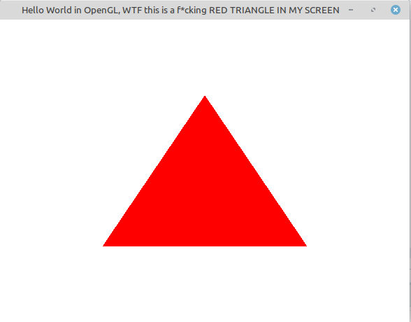

# 01 - Primeiro Triângulo

Primeiro programa OpenGL do repositório — uma janela GLUT exibindo um triângulo vermelho centralizado na tela.



## O que foi aprendido

### Estrutura básica de um programa GLUT

Todo programa OpenGL com GLUT segue a mesma estrutura:

1. `glutInit` — inicializa o GLUT
2. `glutInitDisplayMode` — define o modo de exibição (single/double buffer, depth, etc.)
3. `glutInitWindowSize` — tamanho da janela em pixels
4. `glutCreateWindow` — cria a janela com um título
5. Registro das **funções callback**
6. `glutMainLoop` — inicia o loop de eventos

### Funções callback

O GLUT trabalha com callbacks — funções registradas que são chamadas automaticamente pelo sistema em resposta a eventos:

| Callback | Função registrada | Descrição |
|---|---|---|
| `glutDisplayFunc` | `Draw` | Chamada sempre que a janela precisa ser redesenhada |
| `glutKeyboardFunc` | `KeyboardHandler` | Chamada ao pressionar uma tecla ASCII |

### Janela de visualização 2D

Definida na função `Initialize()` usando a matriz de projeção ortográfica:

```cpp
glMatrixMode(GL_PROJECTION);
gluOrtho2D(-1.0, 1.0, -1.0, 1.0);
```

Isso estabelece um sistema de coordenadas 2D onde o centro da janela é a origem `(0,0)` e os limites vão de `-1` a `1` em ambos os eixos.

### Desenhando o triângulo

```cpp
glBegin(GL_TRIANGLES);
    glVertex3f(-0.5, -0.5, 0);  // vértice inferior esquerdo
    glVertex3f( 0,    0.5, 0);  // vértice superior central
    glVertex3f( 0.5, -0.5, 0);  // vértice inferior direito
glEnd();
```

O par `glBegin / glEnd` delimita a lista de vértices. `GL_TRIANGLES` indica que cada grupo de 3 vértices forma um triângulo.

### Cor e limpeza da tela

```cpp
glClearColor(1, 1, 1, 0); // fundo branco
glClear(GL_COLOR_BUFFER_BIT);
glColor3f(1, 0, 0);       // desenho vermelho (R=1, G=0, B=0)
```

### Saindo com ESC

```cpp
void KeyboardHandler(unsigned char key, int x, int y)
{
    if (key == 27) // 27 = código ASCII do ESC
        exit(0);
}
```

## Compilando e executando

```bash
c++ triangleInScreen.cpp -o triangleInScreen -lGL -lGLU -lglut && ./triangleInScreen
```

## Referência

Cohen, Marcelo. *OpenGL: Uma Abordagem Prática e Objetiva*. Capítulo 3. First Program.