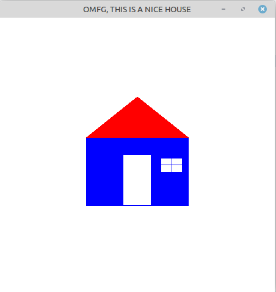

# 02 - Desenho de uma Casa

Exemplo do **Capítulo 7** do livro, uma casinha composta por múltiplas primitivas OpenGL, com suporte a redimensionamento de janela mantendo proporção correta.



## O que foi aprendido

### Múltiplas primitivas no mesmo desenho

Diferente do triângulo simples, a casa combina três primitivas distintas numa mesma cena:

| Primitiva | Uso |
|---|---|
| `GL_QUADS` | Parede da casa, porta e janela |
| `GL_TRIANGLES` | Telhado |
| `GL_LINES` | Divisórias da janela |

### Callback de redimensionamento — `glutReshapeFunc`

O conceito mais importante deste capítulo. Registra uma função chamada automaticamente sempre que a janela é redimensionada:

```cpp
glutReshapeFunc(AlteraTamanhoJanela);
```

Sem ela, a cena estica e distorce ao redimensionar a janela. A função corrige isso recalculando a projeção com base na nova proporção:

```cpp
void AlteraTamanhoJanela(GLsizei w, GLsizei h)
{
    if(h == 0) h = 1; // evita divisão por zero

    glViewport(0, 0, w, h);
    glMatrixMode(GL_PROJECTION);
    glLoadIdentity();

    if (w <= h)
        gluOrtho2D(-40.0f, 40.0f, -40.0f*h/w, 40.0f*h/w);
    else
        gluOrtho2D(-40.0f*w/h, 40.0f*w/h, -40.0f, 40.0f);
}
```

### Viewport

```cpp
glViewport(0, 0, largura, altura);
```

Define a região da janela onde o OpenGL vai renderizar. Ao redimensionar, a viewport precisa ser atualizada para ocupar a janela inteira.

### glLoadIdentity

```cpp
glMatrixMode(GL_PROJECTION);
glLoadIdentity();
```

Reseta a matriz de projeção para a identidade antes de redefinir a janela de seleção. Sem isso, as transformações se acumulam a cada redimensionamento.

### Cor de fundo via Inicializa

```cpp
void Inicializa(void)
{
    glClearColor(1.0f, 1.0f, 1.0f, 1.0f); // fundo branco
}
```

A cor de fundo é definida uma única vez na inicialização, não dentro do loop de desenho — boa prática para separar configuração de renderização.

### Posição inicial da janela

```cpp
glutInitWindowPosition(5, 5);
```

Define onde a janela vai aparecer na tela ao abrir, em pixels a partir do canto superior esquerdo.

## Compilando e executando

```bash
c++ house.cpp -o casa -lGL -lGLU -lglut && ./casa
```

## Referência

Cohen, Marcelo e Harb, Isabel. *OpenGL: Uma Abordagem Prática e Objetiva*. Capítulo 7.