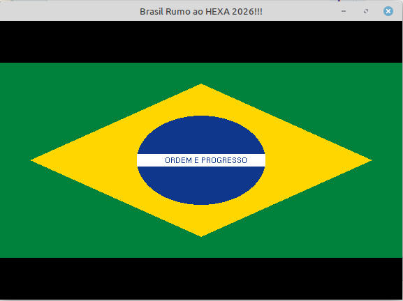

# 🇧🇷 Bandeira do Brasil - Copa do Mundo 2026

> *"Em ritmo de Copa do Mundo 2026, resolvi aplicar os conhecimentos vistos até então para desenhar a bandeira do meu país em OpenGL."*



## A ideia

Com a Copa do Mundo 2026 acontecendo, nada mais justo do que usar as primitivas aprendidas nos primeiros capítulos para homenagear o Brasil — verde, amarelo, azul e branco desenhados pixel a pixel (bem, vértice a vértice, *só faltou as estrelas...*) com OpenGL legado.

## O que foi usado

Tudo que os capítulos iniciais ensinaram, aplicado de uma vez só:

| Técnica | Aplicação na bandeira |
|---|---|
| `GL_QUADS` | Retângulo verde de fundo e losango amarelo |
| `GL_TRIANGLE_FAN` | Círculo azul |
| `GL_QUADS` | Faixa branca |
| `glColor3f` | Cores da bandeira (verde, ouro, azul) |
| `gluOrtho2D` | Sistema de coordenadas 2D normalizado |
| `glutBitmapCharacter` | Texto "ORDEM E PROGRESSO" na faixa |

## O círculo

A parte mais interessante, sem primitiva de círculo nativa no OpenGL legado, a solução é usar `GL_TRIANGLE_FAN` com trigonometria:

```cpp
void DrawCircle(float cx, float cy, float r)
{
    int numSegments = 100;
    glBegin(GL_TRIANGLE_FAN);
        glVertex2f(cx, cy); // centro
        for (int i = 0; i <= numSegments; i++) {
            float angle = 2.0f * M_PI * i / numSegments;
            glVertex2f(cx + r * cos(angle), cy + r * sin(angle));
        }
    glEnd();
}
```

100 triângulos saindo do centro formam um círculo visualmente perfeito. Quanto mais segmentos, mais suave a borda.

## Compilando e executando

```bash
c++ bandeira.cpp -o bandeira -lGL -lGLU -lglut -lm && ./bandeira
```

> O `-lm` é necessário por causa das funções `cos()` e `sin()` da `<math.h>`.

## Vai Brasil! 🏆